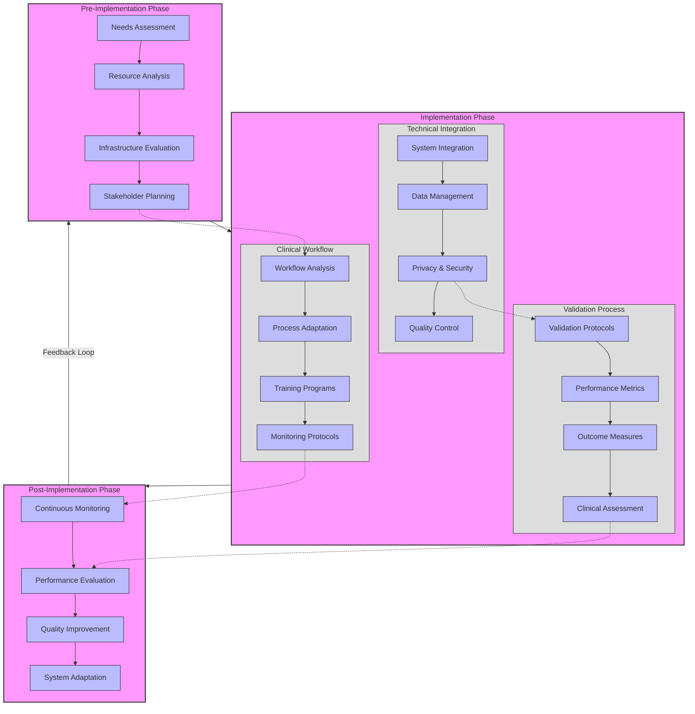

# Implementation Framework for AI in Healthcare

## Framework Components

1. **Pre-Implementation Phase** [@Alowais2023]
   - Needs Assessment: Identify clinical requirements
   - Resource Analysis: Evaluate available resources
   - Infrastructure Evaluation: Assess technical readiness
   - Stakeholder Planning: Engage key participants

2. **Implementation Phase**
   - Technical Integration [@DenizGarcia2023]
     * System Integration
     * Data Management
     * Privacy & Security
     * Quality Control
   - Clinical Workflow [@Stafie2023]
     * Workflow Analysis
     * Process Adaptation
     * Training Programs
     * Monitoring Protocols
   - Validation Process [@FusarPoli2022]
     * Validation Protocols
     * Performance Metrics
     * Outcome Measures
     * Clinical Assessment

3. **Post-Implementation Phase** [@Toit2023]
   - Continuous Monitoring
   - Performance Evaluation
   - Quality Improvement
   - System Adaptation

## Key Features

1. **Iterative Process**
   - Feedback loops between phases
   - Continuous improvement cycle
   - Adaptive response to challenges

2. **Integration Points**
   - Technical-Clinical interface
   - Validation checkpoints
   - Monitoring systems

3. **Quality Assurance**
   - Validation protocols
   - Performance metrics
   - Outcome measures

4. **Citations**
   - Implementation methodology [@Alowais2023]
   - Technical integration [@DenizGarcia2023]
   - Clinical workflow [@Stafie2023]
   - Validation framework [@FusarPoli2022]
   - Quality metrics [@Toit2023]