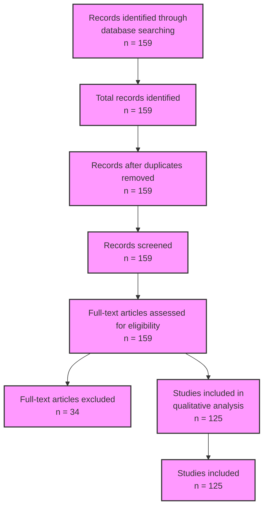

# PRISMA Flow Diagram for AI in Medicine Systematic Review

## Diagram Notes

1. **Identification**
   - Records identified via PubMed database search: 159
   - Total records identified: 159

2. **Screening**
   - Total records: 159
   - All records were assessed for eligibility

3. **Eligibility**
   - Full-text articles assessed: 159
   - Articles excluded: 34

4. **Included**
   - Studies included in qualitative analysis: 125
   - Studies included: 125

## References
- PRISMA guidelines [@Page2021]