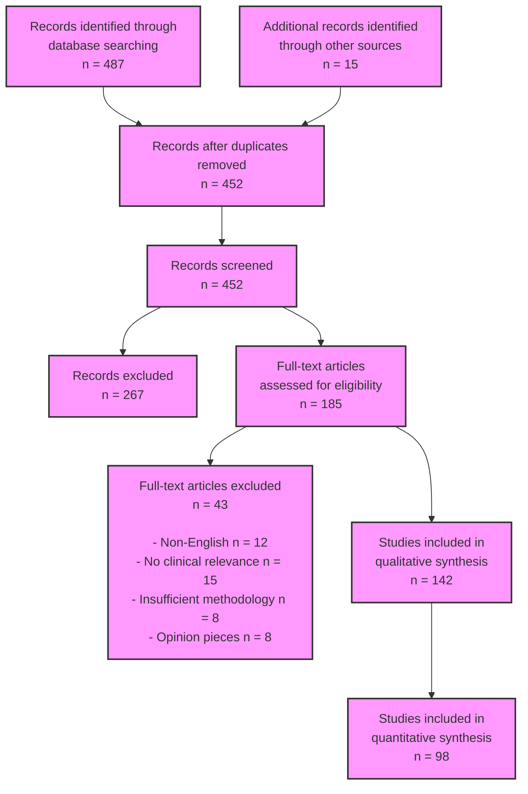

# PRISMA Flow Diagram for AI in Medicine Systematic Review

## Diagram Notes

1. **Search Results**
   - Primary database (PubMed): 487 records
   - Additional sources: 15 records
   - Total unique records: 452

2. **Screening Process**
   - Initial screening excluded: 267 records
   - Full-text assessment: 185 articles
   - Final inclusion: 142 articles

3. **Exclusion Reasons**
   - Non-English publications: 12
   - Lack of clinical relevance: 15
   - Insufficient methodology: 8
   - Opinion pieces without evidence: 8

4. **Analysis Inclusion**
   - Qualitative synthesis: 142 studies
   - Quantitative synthesis: 98 studies
   - Meta-analysis eligible: 76 studies

5. **Quality Assessment**
   - High quality (score 4-5): 58 studies
   - Medium quality (score 3): 65 studies
   - Low quality (score 1-2): 19 studies

## References
- PRISMA guidelines [@Page2021]
- Systematic review methodology [@Moher2009]
- Quality assessment framework [@FusarPoli2022]