# Quality Assessment Summary for Included Studies

```mermaid
graph TD
    subgraph Quality["Overall Quality Distribution (n=142)"]
        H[High Quality<br>4-5 points<br>n=58] --- M[Medium Quality<br>3 points<br>n=65] --- L[Low Quality<br>1-2 points<br>n=19]
    end

    subgraph Metrics["Quality Assessment Metrics"]
        MR[Methodology Rigor<br>Mean: 3.8/5] --- ES[Evidence Strength<br>Mean: 3.5/5]
        ES --- CR[Clinical Relevance<br>Mean: 3.9/5] --- IF[Implementation<br>Feasibility<br>Mean: 3.6/5]
    end

    subgraph Distribution["Quality by Research Focus"]
        direction LR
        PI[Privacy & Implementation<br>Mean: 3.9/5<br>n=45] --- CI[Clinical Integration<br>Mean: 3.7/5<br>n=38]
        CI --- EC[Ethics & Compliance<br>Mean: 3.4/5<br>n=32] --- DG[Data Governance<br>Mean: 3.6/5<br>n=27]
    end

    classDef high fill:#90EE90,stroke:#333,stroke-width:2px;
    classDef med fill:#FFD700,stroke:#333,stroke-width:2px;
    classDef low fill:#FFB6C1,stroke:#333,stroke-width:2px;
    classDef metric fill:#E6E6FA,stroke:#333,stroke-width:2px;
    classDef focus fill:#F0F8FF,stroke:#333,stroke-width:2px;

    class H high;
    class M med;
    class L low;
    class MR,ES,CR,IF metric;
    class PI,CI,EC,DG focus;
```

## Assessment Details

1. **Quality Criteria**
   - Methodology Rigor (1-5 points)
     * Research design
     * Sample size
     * Data collection
     * Analysis methods
   - Evidence Strength (1-5 points)
     * Statistical significance
     * Effect size
     * Replication potential
     * External validity
   - Clinical Relevance (1-5 points)
     * Healthcare impact
     * Practice applicability
     * Patient outcomes
     * Implementation feasibility
   - Implementation Feasibility (1-5 points)
     * Resource requirements
     * Technical complexity
     * Integration effort
     * Maintenance needs

2. **Quality Distribution by Year**
   - 2023-2025 (n=110)
     * High: 45 studies
     * Medium: 52 studies
     * Low: 13 studies
   - 2020-2022 (n=27)
     * High: 11 studies
     * Medium: 12 studies
     * Low: 4 studies
   - 2017-2019 (n=5)
     * High: 2 studies
     * Medium: 1 studies
     * Low: 2 studies

3. **Inter-rater Reliability**
   - Cohen's Kappa: 0.82
   - Percent Agreement: 87%
   - Number of Raters: 3
   - Resolution Process: Consensus discussion

4. **Quality Trends**
   - Increasing methodology rigor over time
   - Stronger evidence in recent studies
   - Better implementation feasibility in later papers
   - More comprehensive clinical validation

## References
- Quality assessment framework [@FusarPoli2022]
- Evidence grading system [@Stafie2023]
- Implementation feasibility metrics [@Toit2023]
- Clinical relevance criteria [@Mathur2020]