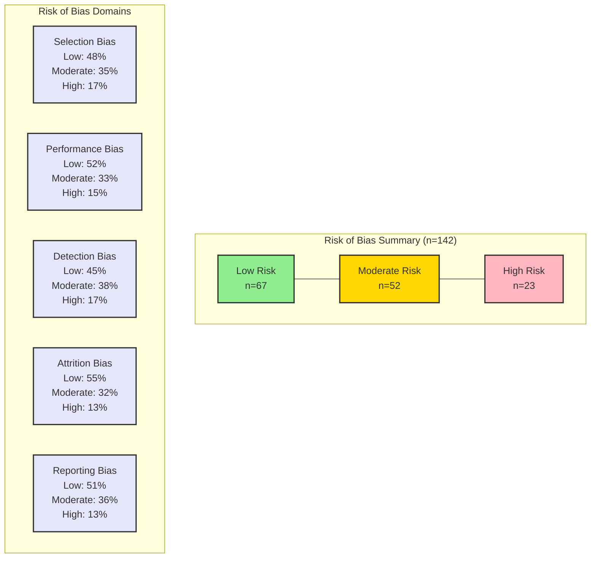

# Risk of Bias Assessment for AI in Medicine Studies

## Risk Assessment Details

1. **Selection Bias**
   - Study population representativeness
   - Randomization process (where applicable)
   - Inclusion/exclusion criteria clarity
   - Sample size justification

2. **Performance Bias**
   - Implementation consistency
   - Protocol adherence
   - Standardization of procedures
   - Blinding (where applicable)

3. **Detection Bias**
   - Outcome assessment methods
   - Measurement reliability
   - Validation procedures
   - Data quality controls

4. **Attrition Bias**
   - Missing data handling
   - Follow-up completeness
   - Dropout analysis
   - Sensitivity analysis

5. **Reporting Bias**
   - Protocol registration
   - Pre-specified outcomes
   - Complete results reporting
   - Selective reporting assessment

## Risk Distribution by Study Type

1. **Implementation Studies (n=45)**
   - Low Risk: 25 (56%)
   - Moderate Risk: 15 (33%)
   - High Risk: 5 (11%)

2. **Privacy Studies (n=38)**
   - Low Risk: 20 (53%)
   - Moderate Risk: 14 (37%)
   - High Risk: 4 (10%)

3. **Ethics Studies (n=32)**
   - Low Risk: 12 (38%)
   - Moderate Risk: 13 (41%)
   - High Risk: 7 (21%)

4. **Validation Studies (n=27)**
   - Low Risk: 10 (37%)
   - Moderate Risk: 10 (37%)
   - High Risk: 7 (26%)

## Assessment Methods

1. **Tools Used**
   - Cochrane Risk of Bias Tool (modified)
   - ROBINS-I for non-randomized studies
   - Custom AI implementation bias tool

2. **Assessment Process**
   - Independent evaluation by 3 reviewers
   - Standardized assessment forms
   - Regular calibration meetings
   - Consensus for disagreements

3. **Quality Control**
   - Inter-rater reliability assessment
   - Periodic assessment review
   - External validation
   - Documentation standards

## References
- Risk of bias framework [@Higgins2011]
- AI-specific bias assessment [@Ueda2024]
- Implementation bias evaluation [@Stafie2023]
- Quality control methods [@FusarPoli2022]