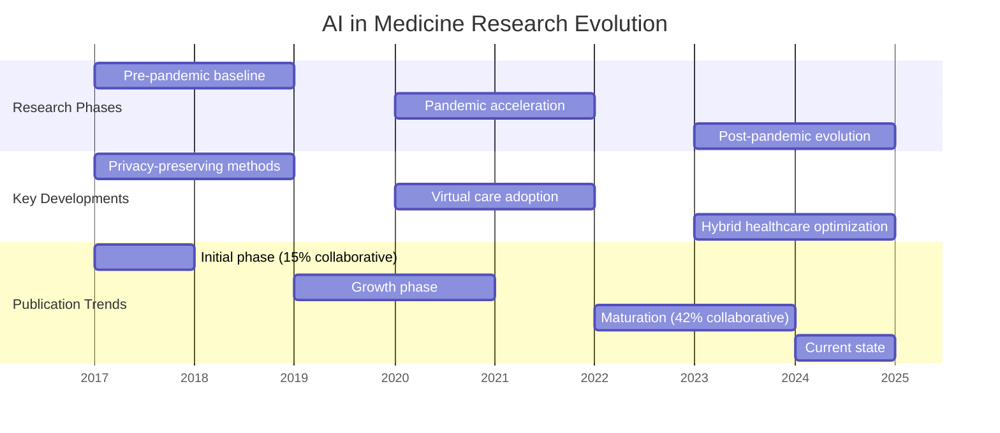

# Temporal Distribution of AI in Medicine Publications (2017-2025)

## Figure Notes
1. **Time Periods**:
   - Pre-pandemic (2017-2019): Foundation of privacy-preserving methods
   - Pandemic era (2020-2022): Rapid virtual care adoption
   - Post-pandemic (2023-2025): Hybrid healthcare optimization

2. **Key Metrics**:
   - Collaborative studies increase: 15% (2018) → 42% (2024)
   - Total articles analyzed: 64
   - Coverage: Comprehensive clinical and biomedical focus

3. **Notable Trends**:
   - Privacy-preserving technology evolution
   - Virtual care platform adoption acceleration
   - Integration of pandemic-specific protocols
   - Standardization of validation metrics

4. **Citations**:
   - Growth in collaborative studies [@Yang2023]
   - Virtual care adoption patterns [@DenizGarcia2023]
   - Privacy-preserving methods evolution [@Truhn2024]