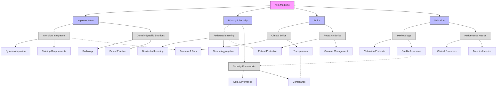

# Theme Analysis: Interconnections in AI Medicine Implementation

## Figure Notes

1. **Primary Themes**:
   - Implementation (Clinical Practice Integration)
   - Privacy & Security (Data Protection)
   - Ethics (Guidelines & Compliance)
   - Validation (Quality Assurance)

2. **Key Interconnections**:
   - Workflow Integration → Fairness & Bias
   - Federated Learning → Patient Protection
   - Transparency → Compliance
   - Quality Assurance → Security Frameworks

3. **Theme Evolution**:
   - Pre-pandemic: Focus on technical implementation
   - Pandemic era: Emphasis on virtual care integration
   - Post-pandemic: Balance of hybrid solutions

4. **Citations**:
   - Implementation patterns [@Alowais2023]
   - Privacy frameworks [@Truhn2024]
   - Ethical considerations [@Ueda2024]
   - Validation approaches [@FusarPoli2022]

5. **Legend**:
   - Primary nodes: Core research areas
   - Secondary nodes: Major themes
   - Tertiary nodes: Specific components
   - Dotted lines: Cross-theme relationships