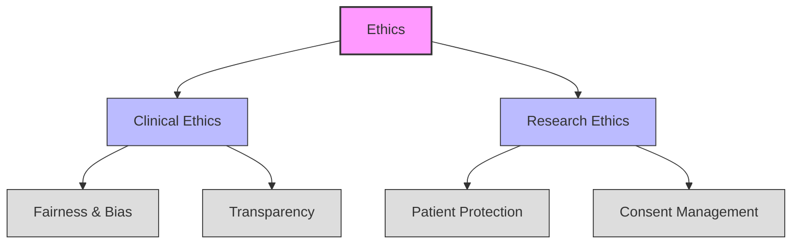

# Theme Analysis: Ethics

## Figure Notes

1. **Primary Theme**: Ethics (Guidelines & Compliance)

2. **Components**:
   - Clinical Ethics
   - Research Ethics

3. **Sub-components**:
   - Fairness & Bias
   - Transparency
   - Patient Protection
   - Consent Management

4. **Cross-cutting Relationships**:
   - Transparency → Compliance (in main theme_analysis.md)
   - Workflow Integration → Fairness & Bias (in main theme_analysis.md)

5. **Citations**:
   - Ethical considerations [@Ueda2024; @Filippi2023]
   - Fairness and bias in AI [@Walsh2020]
   - Patient protection frameworks [@Monah2022]

## References
- Theme analysis framework [@Carini2024]