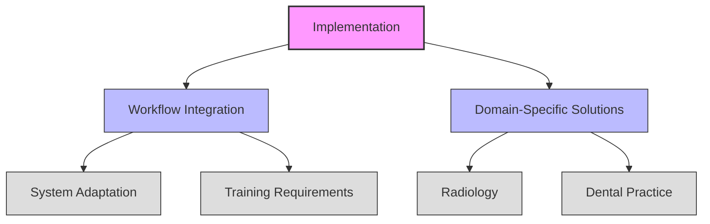

# Theme Analysis: Implementation

## Figure Notes

1. **Primary Theme**: Implementation (Clinical Practice Integration)

2. **Components**:
   - Workflow Integration
   - Domain-Specific Solutions

3. **Sub-components**:
   - System Adaptation
   - Training Requirements
   - Radiology
   - Dental Practice

4. **Cross-cutting Relationships**:
   - Workflow Integration → Fairness & Bias (in main theme_analysis.md)
   - Quality Assurance → Security Frameworks (in main theme_analysis.md)

5. **Citations**:
   - Implementation patterns [@Alowais2023]
   - Workflow challenges [@DenizGarcia2023]
   - Domain-specific solutions [@Ozcan2023; @Pethani2021]

## References
- Theme analysis framework [@Carini2024]