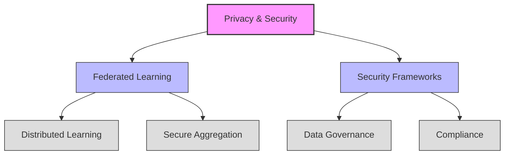

# Theme Analysis: Privacy & Security

## Figure Notes

1. **Primary Theme**: Privacy & Security (Data Protection)

2. **Components**:
   - Federated Learning
   - Security Frameworks

3. **Sub-components**:
   - Distributed Learning
   - Secure Aggregation
   - Data Governance
   - Compliance

4. **Cross-cutting Relationships**:
   - Federated Learning → Patient Protection (in main theme_analysis.md)
   - Quality Assurance → Security Frameworks (in main theme_analysis.md)

5. **Citations**:
   - Privacy frameworks [@Price2019]
   - Federated learning implementations [@Truhn2024; @Yang2023]
   - Security frameworks [@Monah2022]

## References
- Theme analysis framework [@Carini2024]