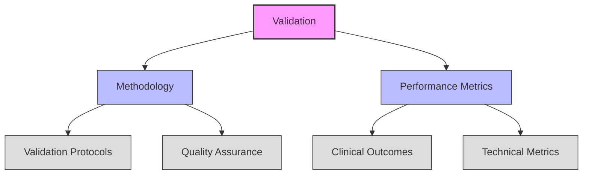

# Theme Analysis: Validation

## Figure Notes

1. **Primary Theme**: Validation (Quality Assurance)

2. **Components**:
   - Methodology
   - Performance Metrics

3. **Sub-components**:
   - Validation Protocols
   - Quality Assurance
   - Clinical Outcomes
   - Technical Metrics

4. **Cross-cutting Relationships**:
   - Quality Assurance → Security Frameworks (in main theme_analysis.md)
   - Implementation → Validation (in main theme_analysis.md)

5. **Citations**:
   - Validation approaches [@FusarPoli2022]
   - Clinical validation metrics [@Gallone2022]
   - Performance evaluation [@Toit2023]

## References
- Theme analysis framework [@Carini2024]